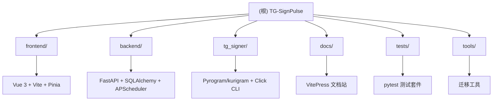

# TG-SignPulse

> Telegram 消息监测系统 — 自动化 Telegram 签到、消息发送、关键词监控、AI 回复等任务的统一管理面板。

## 变更记录 (Changelog)

| 日期 | 变更内容 |
|------|----------|
| 2026-06-30 | 初始化根级 CLAUDE.md，含架构总览、模块索引、Mermaid 结构图 |
| 2026-06-30 | 补扫：TelegramService 登录流程、4 个后端路由、3 个前端 Views、tg_signer 核心类 |
| 2026-06-30 | 补扫：backend/utils/ 13 个工具模块、tools/ 迁移脚本、前端剩余 3 个 Views |
| 2026-06-30 | 补扫：前端 Composables、tg_signer/config.py 配置模型；验证 5 项关键发现 |
| 2026-06-30 | 补扫：tg_signer/core.py 前半段（Client 生命周期）、前端 13 个 Components；规划 token/any 修复方案 |
| 2026-07-01 | 新增账号设备管理、设备保活、官方消息查看、批量状态检查功能 |

## 项目愿景

TG-SignPulse 是一个基于 Node.js (Vue 3) + Python (FastAPI) 的 Telegram 自动化任务管理平台，提供 Web 面板统一管理多个 Telegram 账号的定时签到、消息交互、关键词监控和 AI 辅助回复。

## 架构总览



### 技术栈

| 层级 | 技术选型 |
|------|----------|
| 前端 | Vue 3 + TypeScript + Vite + Pinia + Tailwind CSS + vue-i18n |
| 后端 API | FastAPI + SQLAlchemy + APScheduler + Pydantic v1 |
| Telegram 引擎 | Pyrogram / kurigram (tg_signer 子包) |
| 数据库 | SQLite (WAL 模式) |
| 认证 | JWT (HS256) + bcrypt + TOTP (pyotp) |
| 部署 | Docker 多阶段构建 + GHCR + docker-compose |
| 文档 | VitePress |
| 测试 | pytest + pytest-asyncio + pytest-cov |

## 模块索引

| 模块 | 路径 | 语言 | 职责 |
|------|------|------|------|
| 前端面板 | `frontend/` | TypeScript/Vue | Web 管理界面，Dashboard/Accounts/Tasks/Logs/Settings |
| 后端 API | `backend/` | Python | FastAPI REST 接口、任务调度、账号管理、签到执行 |
| Telegram 引擎 | `tg_signer/` | Python | Pyrogram 封装、签到/监控 CLI、配置模型 |
| 文档站 | `docs/` | Markdown/VitePress | 用户指南、部署文档、架构参考 |
| 测试 | `tests/` | Python | pytest 单元/集成测试 |
| 工具 | `tools/` | Python | 迁移脚本（session 导出、Bot 监听测试） |

## 运行与开发

### 前置要求

- Python 3.10-3.13
- Node.js >= 22.12.0

### 本地开发

```bash
# 后端 (端口 8080)
pip install -e ".[dev]"
uvicorn backend.main:app --host 127.0.0.1 --port 8080

# 前端 (端口 3000，代理 /api 到 8080)
cd frontend
npm install
npm run dev

# 文档站 (端口 5173)
npm run docs:dev
```

### Docker 部署

```bash
# 构建并运行
docker-compose -f docker-compose.panel.yml up -d

# 或使用 GHCR 镜像
docker run -d -p 3000:3000 -v ./data:/data ghcr.io/<owner>/tg-signpulse:latest
```

### 环境变量

| 变量 | 默认值 | 说明 |
|------|--------|------|
| `APP_HOST` | `127.0.0.1` | 后端监听地址 |
| `APP_PORT` | `3000` | 后端监听端口 |
| `APP_DATA_DIR` | 自动检测 | 数据目录路径 |
| `APP_SECRET_KEY` | 自动生成 | JWT 签名密钥 |
| `ADMIN_PASSWORD` | 随机生成 | 初始管理员密码 |
| `LOG_LEVEL` | `INFO` | 日志等级 |
| `TZ` | `Asia/Hong_Kong` | 时区 |

## 测试策略

- **框架**: pytest + pytest-asyncio
- **覆盖**: `pytest-cov` 最低 25% 门槛
- **运行**: `pytest` (根目录)
- **测试目录**: `tests/`，含 factories、fixtures、mocks 三层结构
- **主要测试文件**: `test_api.py`, `test_core.py`, `test_services.py`, `test_signer_isolation.py`, `test_config.py`, `test_utils.py`, `test_cache.py`, `test_session_cache.py`, `test_async_io.py`, `test_memory_monitor.py`, `test_batch_api.py`, `test_task_runner.py`, `test_keyword_monitor.py`, `test_log_optimization.py`, `test_ai_tools.py`

## 编码规范

- **Python**: 遵循 PEP 8，使用 ruff 做静态检查 (line-length=88)
- **TypeScript**: vue-tsc 严格模式 + Vite 构建
- **注释**: 中文注释，描述意图与使用方式
- **提交语言**: 中文 Commit 信息

## 关键架构洞察（补扫 2026-06-30）

### tg_signer/core.py 核心类

| 类 | 行号范围 | 职责 |
|----|----------|------|
| `UserSigner` | 1019-2982 | 自动签到执行器，继承 `BaseUserWorker[SignConfigV3]`，含 cron 调度、会话预热（5 级回退）、6 种动作类型、流程级重试 |
| `UserMonitor` | 2984-3265 | 消息监控器，继承 `BaseUserWorker[MonitorConfig]`，规则匹配 → 外部转发（UDP/HTTP）→ AI 回复 → Server酱推送 |

**AI 交互场景**（5 种）：计算题、图片 OCR、图片选按钮、计算后点击、监控回复

### backend/utils/ 工具层

| 热模块 | 职责 |
|--------|------|
| `time.py` | 统一 UTC 时间（9 处引用，全模块最热） |
| `tg_session.py` | 会话持久化 + 并发信号量（352 行，最大文件） |
| `task_logs.py` | 流程日志解析（时间戳去除、目标消息提取） |
| `storage.py` | 数据目录发现/覆盖/回退 |
| `proxy.py` | 代理 URL 标准化 |
| `account_locks.py` | 账号级异步锁 |

> 工具层：`cache.TTLCache` 已接入签到任务列表缓存；`memory_monitor` 在 main 启动；`session_cache` / `async_io` 仍以测试与可复用组件形式保留

### tg_signer/config.py 配置模型（565 行）

**版本迁移链**：`SignConfigV1` → `SignConfigV2` → `SignConfigV3`（当前）

| 模型 | 用途 |
|------|------|
| `SignConfigV3` | 当前签到配置（chats + sign_at + random_seconds） |
| `SignChatV3` | 单 chat 配置（actions 列表 + message_thread_id） |
| `SignAction` + 8 子类 | 动作多态（discriminated by `action` 字段） |
| `MonitorConfig` | 关键词监控配置（match_cfgs 列表） |
| `MatchConfig` | 消息匹配规则（chat + user + text + 转发/推送） |

**8 种动作类型**：发送文本、发送骰子、按文本点击键盘、按图片选选项、计算题回复、图片识别回复、计算后点击按钮、关键词监听通知

**设计特点**：
- `BaseJSONConfig.load()` 自动尝试旧版本迁移
- Pydantic v1/v2 兼容
- `MatchConfig` 封装消息匹配逻辑（exact/contains/regex/all）

### tg_signer/core.py 前半段（1-881 行）

| 类/函数 | 行号 | 职责 |
|---------|------|------|
| `Client(BaseClient)` | 264-390 | Pyrogram 客户端封装，引用计数共享访问，自动重连 |
| `get_client()` | 425-476 | 客户端工厂，全局 `_CLIENT_INSTANCES` 缓存 |
| `close_client_by_name()` | 477-520 | 强制关闭客户端，5s 锁超时 |
| `BaseUserWorker(Generic[ConfigT])` | 536-966 | 任务/监控基类，含配置加载、登录、消息发送、AI 工具获取 |
| `Waiter` | 968-995 | 异步事件集合（add/discard/sub/clear） |
| `UserSignerWorkerContext` | 997-1018 | 签到上下文（消息缓存、回调答案、停止标志） |

**Client 生命周期**：
- 连接：`__aenter__` → 引用计数 +1 → 首次连接重试 5 次（SQLite 锁等待 2+attempt*3 秒）
- 断开：`__aexit__` → 引用计数 -1 → 归零时 stop + 清理全局字典
- 调用：`_patched_invoke` 信号量限流 50 + FloodWait 指数退避

### 前端 Components（13 个）

| 类别 | 组件 | 复杂度 |
|------|------|--------|
| 基础 UI | Modal, CustomSelect, MultiSelect, DatePicker, GlobalToast, LanguageSwitch | 低-中 |
| 账号 | AddAccountModal（3 种登录流程）, EditAccountModal | 中-高 |
| 任务 | AddTaskModal, EditTaskModal, TaskForm（17 ref 自动 buildPayload）, TaskLogsModal（WS+HTTP 降级） | 中-高 |
| 设置 | UserProfileModal（用户名/密码/TOTP 三 Tab） | 高 |

### 前端 Composables

| 文件 | 引用数 | 状态 |
|------|--------|------|
| `useI18n.ts` | 17 | 核心依赖 |
| `useTheme.ts` | 2 | 正常 |
| `useToast.ts` | 1 | show 方法未被调用 |


### 双任务体系

| 体系 | 路由 | 存储 | 服务 | 状态 |
|------|------|------|------|------|
| 旧版 | `tasks.py` + `POST /batch/tasks` | SQLAlchemy ORM | `services/tasks.py` | **已弃用** |
| 新版 | `sign_tasks_v2.py` + `POST /batch/sign-tasks` | JSON 文件 | `services/sign_tasks.py` | **主路径** |

失败分类：`backend/services/sign_task_failure.py`（写入历史 `failure_category`）。  
运维：`/api/ops/scheduled-jobs`、`/backup/status`、`/backup/export`、`/memory`。  
旧任务：`/api/tasks` 默认只读（`APP_LEGACY_TASKS_READONLY=1`），状态见 `/api/tasks/legacy-status`。  
监听分片：`APP_MONITOR_SHARD=i/n`、`APP_MONITOR_ACCOUNT_ALLOWLIST`。

## AI 使用指引

- 修改代码前必须先研读对应模块的 CLAUDE.md
- 跨模块改动需理解 `tg_signer/core.py` 的 Client 生命周期和 `backend/services/` 的调用链
- 配置模型定义在 `tg_signer/config.py`，后端适配在 `backend/services/sign_tasks.py`
- 前端 API 调用集中在 `frontend/src/lib/api.ts`，类型定义在 `frontend/src/lib/types.ts`
- 登录流程改动需同时理解 `telegram.py` 的两阶段/四阶段设计和全局 session 字典
